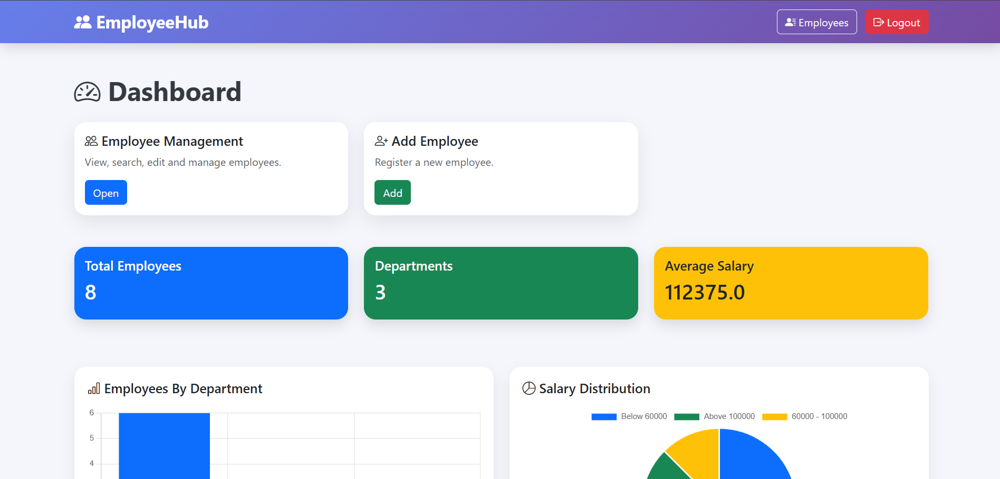
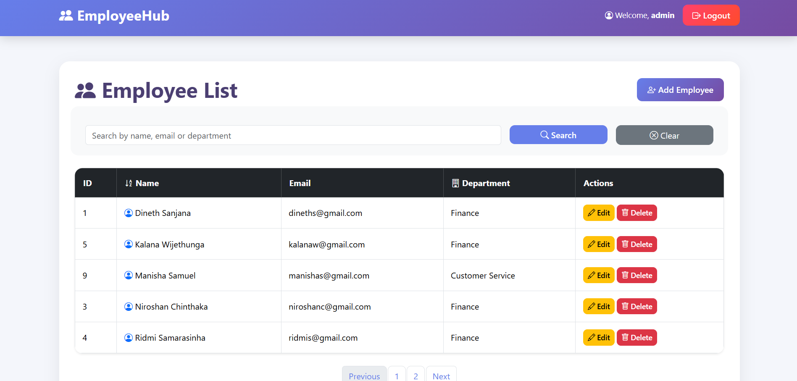
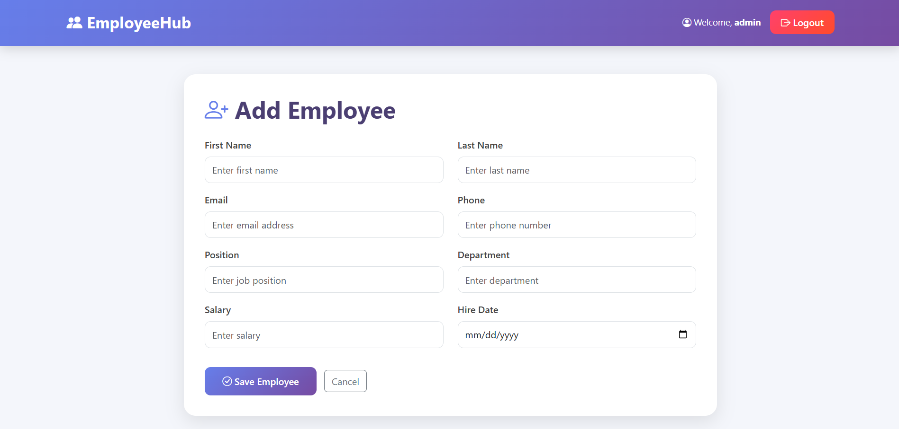
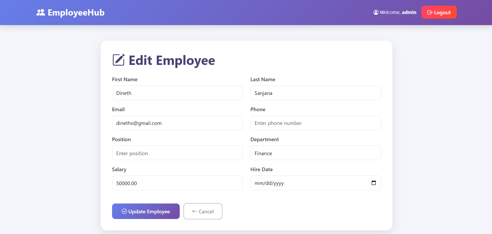

# EmployeeHub

Employee management system built using Spring Boot, Thymeleaf, Spring Security, JPA and MySQL.

## Features

- Employee CRUD operations
- Search employees
- Pagination and sorting
- Form validation
- Role-based authentication
- Admin/User permissions
- Dashboard analytics
- Department statistics
- Salary analytics

## Technologies

- Java
- Spring Boot
- Spring MVC
- Spring Data JPA
- Spring Security
- Thymeleaf
- Bootstrap
- MySQL
- Chart.js

## Screenshots

## Setup

1. Clone repository

2. Configure MySQL database

3. Update application.properties

4. Run application

## Default Users

Admin:
username: admin
password: admin

User:
username: user
password: user